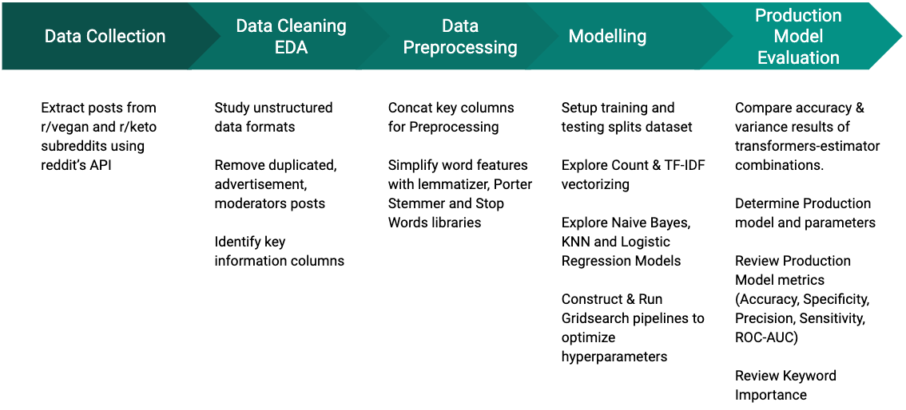

# Problem Statement
Interest in **Diet types** has been trending in recent years. It has become increasingly important for **Food Manufacturers and Dieticians** to understand market interests so that they can conduct proper **Market Segmentations** studies.<br><br>
**Reddit** is an American social news aggregation, web content rating, and discussion website with **over 330 million** monthly active users. There is a wealth of diet related discussions to help companies understand what are the key concerns and needs of their potential market.<br>
<br>
While some subreddits are diet specific (e.g. keto, vegan, paleo etc), there are alot more diet and nutrition subreddits that are not diet specific. Nevertheless, valuable information can still be studied from them. It will be useful to build a **reddit post classifier** that can classify any diet & nutrition post into diet specific classes. Looking ahead, model can also be extended to **chatbots, virtual frontdesk** applications<br>
<br>
In this project we will first train and build **a model that can classify keto and vegan subreddits post with >90% accuracy.** Logistic Regression, K Nearest Neighbors and Naive Bayes models will be explored and evaluated.

# Executive Summary
The Analytics team is rolling out an intelligent classifier that will accurately recognize and classify reddit posts<br>
<br>
Such classifiers can used for doing classification in other related sub-reddits and perhaps expanded into chatbots or virtual frontdesk applications<br>
<br>
Preliminary development focused on 2 diet related ssubreddits namely vegan and keto.<br>
<br>
Production Model Results
- Accuracy: 0.958
- Misclassification Rate: 0.042
- Sensitivity (Recall): 0.943
- Precision: 0.970
- Specificity: 0.973
- Combined Type 1 & 2 error rate is < 5%
- F1 score > 95%
- ROC-AUC score >98%
<br>
The Analytics team is ready and confident to work on other sub-reddits to further expand its capabilities (both diet and non-diet related subjects)

# Methodology


# Directory Structure
```
project_3
|__ overview and codes
|   |__ 1_Project_3_Overview   
|   |__ 2_Data_Collection
|   |__ 3_Data_Cleaning_and_EDA
|   |__ 4_Preprocessing_Modelling
|__ datasets
|   |__ vegan.csv
|   |__ keto.csv
|   |__ vegan_keto.csv
|__ Images
|   |__ p3_methods.png
|__ Presentation.pdf
|__ README.md
```
# Data
- keto subreddit posts (./Data/keto.csv)
- vegan subreddit posts (./Data/vegan.csv)
- combined vegan and keto subreddit posts (./Data/vegan_keto.csv)
### Data Dictionary
|Feature|Type|Dataset|Description|
|---|---|---|---|
|title|str|keto, vegan, vegan_keto|post title|
|selftxt|str|keto, vegan, vegan_keto|post body (many nulls)|
|subreddit|str|keto, vegan, vegan_keto|sub-reddit|
|title_selftext|str|keto, vegan, vegan_keto|title_selftext concat|
|subreddit_tgt|int|vegan_keto|label map (0: vegan, 1: keto)|

# External Research
- **Veganism** is the practice of abstaining from the use of animal products, particularly in diet, and an associated philosophy that rejects the commodity status of animals.
- Dietary vegans (also known as "strict vegetarians") refrain from consuming meat, eggs, dairy products, and any other animal-derived substances.
- https://en.wikipedia.org/wiki/Veganism
- The **ketogenic** diet is a high-fat, adequate-protein, low-carbohydrate diet. The diet forces the body to burn fats rather than carbohydrates.
- It was originally developed to treat hard-to-control (refractory) epilepsy in children. 
- Normally carbohydrates in food are converted into glucose, which is then transported around the body and is important in fueling brain function. But if little carbohydrate remains in the diet, the liver converts fat into fatty acids and ketone bodies, the latter passing into the brain and replacing glucose as an energy source. 
- An elevated level of ketone bodies in the blood (a state called ketosis) eventually lowers the frequency of epileptic seizures.
- https://en.wikipedia.org/wiki/Ketogenic_diet
- In the 2010s, it became a fad diet for people wanting to lose weight.
- https://en.wikipedia.org/wiki/Low-carbohydrate_diet
### Type 1, 2 error implications
- Type 1 error: True vegan post wrongly classified as keto.
- Type 2 error: True keto post wrongly classified as vegan
- People who adopt vegan diets usually do it due to ethical reasons.
- People who adopt lifestyle keto diets usually did it for body image reasons.
- However it is important to note that ketogenic diets were originally developed to treat hard to control epilepsy in children.
- Therefore there are equally serious considerations when considering how much Type 1 or 2 error rates will be acceptable

# Conclusion & Recommendation
- Our preliminary model development methodology has proven to be effective in delivering a highly accurate and precise classifier
- The analytics team is confident that the methodology can be expanded to deliver a more powerful and useful classifier that can be expanded for chatbots and virtual frontdesk applications.
- Model can also generate keywords importance which is an important information for product webpage SEO.
- Therefore we will like to request $42K budget and fundings for the coming fiscal year.